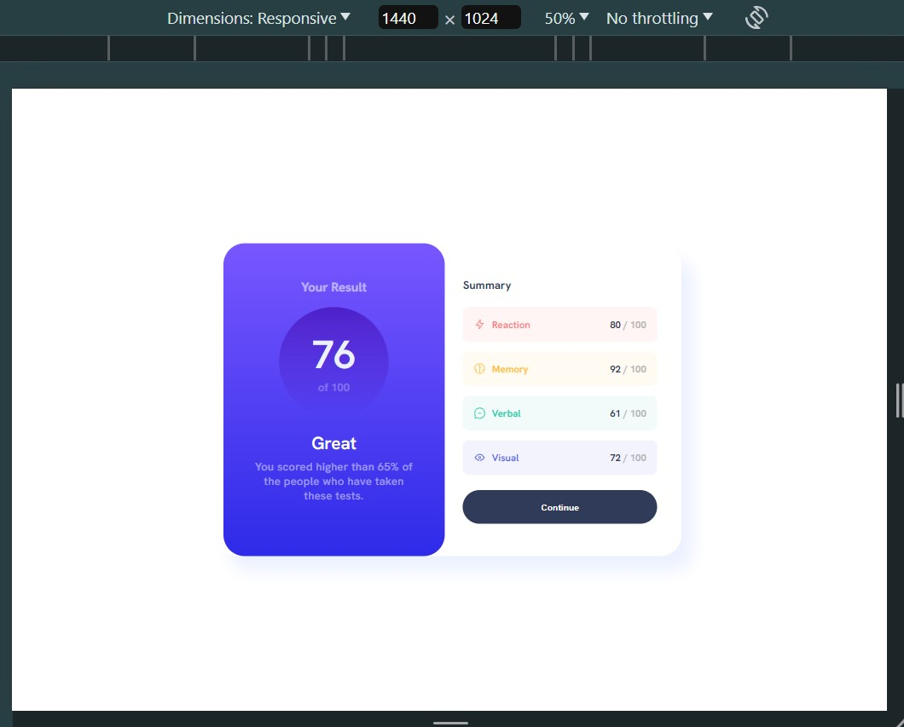

# Frontend Mentor - Results summary component

This is a solution to the [Results summary component coding challenge on Frontend Mentor](https://www.frontendmentor.io/challenges/results-summary-component-CE_K6s0maV).

Frontend Mentor challenges helps improve skills by building realistic projects.

## Table of contents:

- [Overview](#overview)
  - [The challenge](#the-challenge)
  - [Screenshot](#screenshots)
  - [Links](#links)
- [My process](#my-process)
  - [Built with](#built-with)
  - [What I learned](#what-i-learned)
- [Author](#author)
- [Acknowledgments](#acknowledgments)
- [Personal Notes](#notes)

## Overview:

### The challenge:

Users should be able to:

- View the optimal layout depending on their device's screen size
- Get it looking as close to the design as possible.

 

Preview of initial design:

### Screenshots:

| Fullscreen View (Desktop)                             |
| ----------------------------------------------------- |
|  | 

| Animated Preview |
| ---------------------------------------------------------------------------------- |
|                                         |

 

**Note: This is a Mobile-First Approach & Wait for the GIF to load**

 

All viewports were included (except for the 4k view), in case the observer wishes to see the minor changes.

 

| Desktop View (1440px)                                | Laptop View (1024px)                                | Tablet View (768px)                                    |
| ---------------------------------------------------- | --------------------------------------------------- | ------------------------------------------------------ |
|  |  |  |

| Mobile L (430px)                                     | Mobile M (375px)                          |
| ----------------------------------------------------- | ---------------------------------------------------- |
|  | 

### Links:

- Live Site URL: [Website Link - Click Me](https://mark-siazon.github.io/FM-Results-Summary-Component//)
- Solution URL: [FrontEndMentor - Click Me](https://www.frontendmentor.io/solutions/results-summary-component-responsive-mobile-first-using-advance-scss-afUMW1V3q3)

## My process:

### Built with:

- HTML5, CSS3 and SCSS/SASS
- Mobile-First Approach

### What I learned:

Recap over some of the major learnings while working through this project:

#### General things I've learned:

- CSS Flex Layout
- Practice other advanced techniques in utilizing SCSS/SASS (Mixins, Placeholders, Loops, etc.)
- Considering clean code and best practices in using SCSS while doing the project
- Fix over-specified/deep-level styles to keep the CSS file clean and maintainable

## Author:

- Github - [@Iron-Mark](https://github.com/Iron-Mark)
- Github - [@Mark-Siazon](https://github.com/Mark-Siazon)
- Frontend Mentor - [@Iron-Mark](https://www.frontendmentor.io/profile/Iron-Mark)
  - _(The Assets used in this project is originally from FrontendMentor)_

## Acknowledgments:

- I would like to acknowledge the hard work and dedication I put to start creating this project again, after stopping for several months since the 1st step was always the hardest.
- I am grateful for my friends and those who motivate me to push through and not settle for relaxation.
- I hope that this website serves its intended purpose. Thank you!

 

### Next Action (Soon):
- [ ] Add some Javascript Functionalities
- [ ] Create my own modified version of this project.
- [ ] TBA...

## Notes:

- I would be happy to receive comments, criticism, and such that could improve the website:
  - Cleaner Code
  - Better Practice/Approach to making this website.
- Feel free to approach and contact me :>
  - _Jul 9, 2024 (Initial Coding)_
  - _Jul 10, 2024 **Stopped for a day** (Studied more about SASS)_
  - _Jul 11, 2024 (Added Responsiveness + SASS  + Finalize Styles)_
  - _Jul 12, 2024 (Documentation)_
